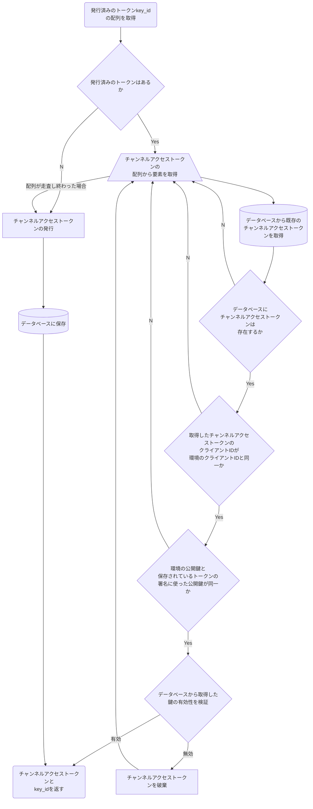

# Channel Access Token / Flowchat

```mermaid
flowchart TD
  id1(発行済みのトークンkey_idの配列を取得) --> id2{発行済みのトークンはあるか};
  id2--Yes-->A[/チャンネルアクセストークンの<br>配列から要素を取得\]-->id3[(データベースから既存の<br>チャンネルアクセストークンを取得)]
  id3-->id5{データベースに<br>チャンネルアクセストークンは<br>存在するか}
  id5--Yes-->id6{取得したチャンネルアクセストークンの<br>クライアントIDが<br>環境のクライアントIDと同一か}
  id6--No-->A
  id5--No-->A
  id6--Yes-->id7{環境の公開鍵と<br>保存されているトークンの<br>署名に使った公開鍵が同一か}
  id7--No-->A
  id7--Yes-->C{データベースから取得した鍵の有効性を検証}--有効-->End(チャンネルアクセストークンと<br>key_idを返す)
  C--無効-->D[チャンネルアクセストークンを破棄]
  D-->A
  id2--No-->issueToken[チャンネルアクセストークンの発行]
  issueToken-->B[(データベースに保存)]
  A--配列が走査し終わった場合-->issueToken
  B-->End

```
